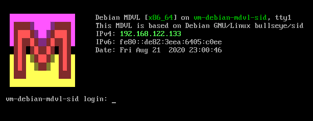

Description
===========

Build instructions for package `mdvl-conf-cli`.

This package serves a similar purpose like a collection of dotfiles and
includes some alias-like scripts.

To build the package, invoke

~~~
$ ant package
~~~

In addition to configuration files, some scripts which serve an alias-like
function are provided. See the following sections for details.

Alias-Scripts
=============

The following scripts are part of this package:

`ctrlc`
:   Copies data from stdin to the clipboard using `xclip`.
    They can be pasted in some GUI applications with [CTRL]-[V].
`ctrlv`
:   Pastes data from the clipboard to stdout using `xclip`.
`rsync_ma`
:   Invokes `rsync` with useful parameters for synchronization:
    `-vrlpEogDtS --delete --delete-after --stats -h --progress -i`
`materm`
:   Invokes `urxvt` with sane defaults.
`materm_white`
:   Invokes `urxvt` with dark font on white background and extra-large font
    size (useful for presentations or working in sunlight).

`masysma_bashrc.sh` -- Ma_Sys.ma `.bashrc` configuration
========================================================

The Ma_Sys.ma `.bashrc` is organized in multiple sections. They are explained
in the following along with some excerpts from the actual code:

## Run Syssheet

The first action is to invoke [syssheet(11)](../11/syssheet.xhtml) to display
system information on newly started terminals or SSH sessions. It is started
first and runs asynchronously because it is one of the slowest operations from
the bashrc to complete:

~~~{.bash}
export LINES
export COLUMNS
sheetpid=
if [ -z "$MAEM_RES" ]; then
	/usr/bin/syssheet -f & # Syssheet is slow => Parallelization is good
	sheetpid=$!
else
	sheetpid=-1
fi
~~~

The process ID is stored to later be able to cancel `syssheet` processes, should
they take too long to complete.

## Basic Shell Settings

Configures the history and enables vi-style keybindings for commandline
modification.

~~~{.bashrc}
HISTCONTROL=ignoredups:ignorespace
HISTSIZE=1000
HISTFILESIZE=2000
shopt -s histappend
shopt -s checkwinsize

# https://serverfault.com/questions/208265
set +H
set -o vi
~~~

## Configure Prompt

~~~{.bash}
ma_host_tmp="$(who -m | cut -d "(" -f 2 | tr -d ")" | cut -d "." -f 1)"
ma_tty_tmp="$(echo $ma_host_tmp | cut -d " " -f 2 | cut -c -3)"
if [ -e /.dockerenv ] || { [ -x /usr/bin/ischroot ] && ischroot; }; then
	# container
	export PS1='\[\033[36;40;1m\]\H:\w\$\[\033]0;\H:\w\$\007\033[00m\] '
elif [ -z "$ma_host_tmp" -o "$ma_host_tmp" = ":0" -o \
					"$ma_tty_tmp" = "tty" ]; then
	# local
	export PS1='\[\033[33;40;1m\]\w\$\[\033]0;\w\$\007\033[00m\] '
else
	# remote
	export PS1='\[\033[31;40;1m\]\H:\w\$\[\033]0;\H:\w\$\007\033[00m\] '
fi
~~~

Here, prompt colors are set depending on the environment. The color assignment
is as follows:

Color    Sample Prompt      Use
-------  -----------------  --------------------------------
yellow   `/$`               Local system login
red      `hostname:~$`      Remote system login
cyan     `3a009206af3e:/#`  Login inside container or chroot

The idea is to warn users with the red prompt that they are working on a remote
system. Additionally, for remote and chroot/container logins, the hostname is
displayed while it should be clear on the local system.

Note that the heuristics to decide between local or remote connections fails
inside terminal multiplexers.

## Editors, PATH, Java

These sections are not shown here. Their use is as follows

 * Configure vi as the editor
 * Let `PATH` include `/usr/sbin`, because `ifconfig` and the like are also
   useful to non-administrator users.
 * Set `JAVA_HOME`, `CLASSPATH` and prefer Java 8 over other installed versions
   (for compatibility with Ma_Sys.ma programs).

## Aliases

~~~{.bash}
alias ls="/bin/ls --color=auto -h"
alias grep="grep --color=auto"
alias info="/usr/bin/info --vi-keys"
alias maxima="/usr/bin/maxima -q"
alias sysus="systemctl --no-pager --user"
alias journalctl="journalctl --no-pager"
alias systemctl="systemctl --no-pager -l"
alias 7z_ma="/usr/bin/7z a -t7z -m0=lzma2 -mx=9 -mfb=64 -md=64m -ms=2g -l"
~~~

`ls` and `grep`
:   Configure colorized output.
`info`
:   Configure vi keybindings.
`maxima`
:   Suppress version information and directly prompt for input.
`sysus`
:   Provide convenient access to user-sytemd
`journalctl`, `systemctl`
:   Disable systemd's insane default-to-pager
    (see <https://bugzilla.redhat.com/show_bug.cgi?id=768601>).
`7z_ma`
:   Provide quick access to better compression with 7z.

## MDVL Simple Login Manager

~~~{.bash}
if [ -z "$DISPLAY" -a -z "$MAEMR_RES" -a "$(tty)" = "/dev/tty1" -a \
							"$(id -u)" != 0 ]; then
	unset sheetpid
	unset sleeppid
	unset LINES
	unset COLUMNS
	# Prevent ck-launch blah to fail automounting when using startx...
	export GDMSESSION=masysma
	# invoke on the same VT to mitigate potential security issues
	exec /usr/bin/startx -- vt1 2> /dev/null > /dev/null
elif [ $sheetpid != -1 ]; then
	( sleep 3 && kill $sheetpid ) 2>&1 > /dev/null & sleeppid=$!
	disown
	wait $sheetpid
	kill -s TERM $sleeppid 2> /dev/null
	echo
fi
~~~

This part of the configuration is concerned with auto-running `startx` if
logging into `tty1`. These few lines have been found to effectively replace the
need for login managers.

For all other instances, `syssheet` is given three seconds to complete before
being killed; `syssheet` can hang if commands like `mount` take too long to
respond, but shell access should still be possible then, thus the timeout.

`vimrc.mdvl` -- Ma_Sys.ma `vimrc` file
======================================

There are tons of online-resources for `vimrc` files. This repository provides
the Ma_Sys.ma variant. Some excerpts are shown and explained in the following.

## Basic settings and includes

The file sets the following basic options:

~~~
set nocompatible
set backspace=indent,eol,start  " more powerful backspacing
set history=400                 " keep 400 lines of command line history
set ruler                       " show the cursor position all the time
set background=dark
~~~

After that, it contains a few lines to source other VIM configuration if it
is present on the system including configuration for Ma_Sys.ma specific formats
or `tetris.vim` :)

A configuration snippet for hex editing is also included (copied from the
VIM wiki?). After that, some more options follow -- including links to
interesting blog posts about `vimrc` files. The links seem to be down, thus
`archive.org` links are given instead.

~~~
set printfont=courier:h9 " Smaller printing font size
set printoptions=formfeed:y,paper:a4
set hlsearch
highlight Search ctermbg=LightGreen
set title
set showcmd
" Copied from http://dougblack.io/words/a-good-vimrc.html
" https://web.archive.org/web/20200202000014/https://dougblack.io/words/a-good-vimrc.html
set wildmenu
set lazyredraw
" Copied from http://amix.dk/vim/vimrc.html
" https://web.archive.org/web/20170222115910/http://amix.dk/vim/vimrc.html
set noerrorbells
set tm=500
set ffs=unix,dos,mac
set laststatus=2
" disable bells
set vb t_vb=
" http://stackoverflow.com/questions/4775605/vim-syntax-highlight-improve-
" 								performance
set nocursorcolumn
set nocursorline
~~~

## Colorcolumn

If available, the last column to be usable for keeping an 80-character limit is
highlighted:

~~~
if exists("+colorcolumn")
	set colorcolumn=80
	hi ColorColumn ctermbg=DarkBlue
endif
~~~

Although somewhat historic, 80 chars is still good to allow large font sizes
without breaking the lines.

It is nice to remember that the `colorcolumn` can be used for e-mails as well,
just type `:set colorcolumn=72` and it moves a little leftward to a common
limit used in e-mail.

## Line Numbers

The configuration of line numbers is also taking the 80 chars width into
consideration: In case the terminal has 86 chars or less, `nonumber` will be
set to avoid breaking the lines. The value for `nuberwidth=6` is based on
experience and works most of the times. By setting a different background color
for line numbers, they are visually well-distinguishable from the actual source
code.

In theory, displaying line numbers should also change as the window size
chagnes, but despite being a good heuristics, it does not always work as
expected...

~~~
set numberwidth=6
set nonumber
highlight LineNr cterm=NONE ctermbg=DarkGray ctermfg=White

" http://stackoverflow.com/questions/13093289/gvim-dynamically-change-font-
" 							based-on-window-size
function MaAutomaticLineNumbers()
	if winwidth(0) > 86
		set number
	else
		set nonumber
	endif
endfunction
~~~

The remainder of the file (not shown) is concerned with some GUI options to make
terminal and `gvim` behave similarly (in case `gvim` is accidentally invoked).

System-Wide Configuration
=========================

## Custom Login Screen

Files `90-masysma.conf` and `helpful_issue` customize the Linux console login
screen to look similar to the following screenshot:

## Intel Virtualization

File `masysma-intel-virtualization.conf` enables nested virtualization for KVM
on Intel processors.

## APT Progress Bar and Colors

File `99masysma.conf` enables colorized progress bars in all APT programs
(most notably: `aptitude`).

## SysRq

All SysRq features are enabled (file `masysma.conf`).
Check the
[Kernel Documentation on SysRq](https://www.kernel.org/doc/html/latest/admin-guide/sysrq.html)
for details on what this is about.

Miscellaneous application-specific Configuration
================================================

 * `subversion` is configured to never store passwords by file `config.mdvl`
 * `/etc/papersize` is set to A4 by `papersize.mdvl`
 * Laptop lid closures are ignored by file `logind.conf.mdvl`
 * `smartmontools` daemon is enabled by file `smartmontools.mdvl`
 * `tmux` is configured to use vi-style keybindings by setting
   `set-window-option -g mode-keys vi` in `tmux.conf`
